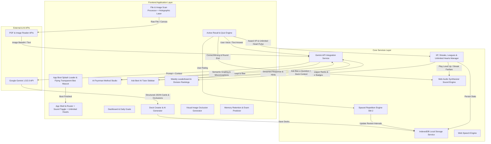

# Gizmo AI Study Engine - System Architecture

## 1. Executive Overview
**Gizmo AI Study** is an intelligent, gamified learning platform inspired by Gizmo.ai and Anki, powered by Google Gemini AI and guided by **Bee**, our live **Transparent Cut-Out 4-Frame Animated AI Mascot** (`BeeAnimatedMascot.jsx`). The application transforms documents, image scans, lecture notes, PDFs, and text into interactive flashcards, quizzes, active recall study sessions, and personalized AI tutoring with Bee, governed by cognitive science principles (Spaced Repetition SM-2/FSRS algorithms and Active Recall).

---

## 2. Technology Stack

| Layer | Technology | Rationale / Purpose |
|---|---|---|
| **Frontend Framework** | **React 18 + Vite** | Ultra-fast build tool, component-based modular structure |
| **Styling & UI** | **Vanilla CSS (Design Tokens & CSS Variables)** | Glassmorphism, smooth CSS keyframes, micro-interactions, dark/light themes |
| **Transparent Live Mascot**| **Transparent 4-Frame Bee Engine (`BeeAnimatedMascot.jsx`)** | Clean cut-out PNGs (`/public/bee_transparent_frame_1.png` to `4`) floating across UI |
| **Icon System** | **Lucide Icons (`lucide-react`)** | Industry-standard, clean, highly customizable open-source icons |
| **AI Integration** | **Google Gemini API (`@google/genai`)** | Flashcard generation, OCR document analysis, AI tutor chat, auto-grading |
| **Document/Image Parsing** | **PDF.js + Canvas / Web API + Gemini Vision** | Extract text & images from PDFs/scans; process OCR via Gemini Vision |
| **Spaced Repetition Engine** | **Custom SM-2 / FSRS Algorithm Implementation** | Computes card interval, ease factor, repetition count, next review date |
| **Gamified Sound Engine** | **Web Audio API Synthesizer Engine (`soundService.js`)** | Zero-latency synth audio for card flips, correct chimes, round victory fanfares |
| **Voice & Speech Engine** | **Web Speech Synthesis & Speech Recognition API** | Hands-free voice study sessions with Bee's audio narration |
| **Data Storage** | **IndexedDB (via Dexie.js or Native Web IDB)** | High performance local offline-first storage for decks, card states, scan previews |
| **State Management** | **React Context API + Custom Hooks** | Lightweight, reactive app state management |

---

## 3. High-Level System Architecture Diagram

---

## 4. Unique Killer Features & Subsystems

### 1. Transparent Flying Bee Mascot Component (`BeeAnimatedMascot.jsx`)
- **Clean Background Removal**: Blue tile background removed via precision floodfill, leaving ONLY the cute cartoon Bee mascot character (winks, dashes, flying paths, waving wings).
- **Dynamic Loading Screen Movement**: Bee flies seamlessly in floating sinusoidal paths (`@keyframes bee-flight-path`) across loading overlays, dark glassmorphism gradients, and study views without any square border!

### 2. Leaderboards, Division Leagues & XP Ranking System
- **Division Leagues**: 5 competitive tiers — Bronze, Silver, Gold, Diamond, and Master League.
- **Weekly Leaderboard**: Displays top learners sorted by Weekly XP, complete with live rank badges, avatars, and promotion/relegation zones.

### 3. Unlimited Hearts System (`Heart` + `∞`)
- **Mechanism**: Features a red Heart icon with an **Infinity (`∞`)** badge. Heart pulse animation triggers on mistakes, but hearts **never deplete**, enabling fear-free practice.

### 4. Web Audio Synthesizer Sound Engine (Gizmo Round Complete & SFX)
- **Round Completion Victory Fanfare**: Arpeggiated victory chord sequence playing upon finishing a study round.

### 5. AI Feynman Method Studio ("Explain to Bee")
- **Workflow**: Student speaks or types an explanation of a card concept. Gemini evaluates the response semantically and awards XP.

### 6. Smart Visual Image Occlusion Cards (Scan Bounding Boxes)
- **Workflow**: Gemini Vision detects labeled diagram regions on uploaded scans and creates mask bounding boxes.

---

## 5. Spaced Repetition Engine (SuperMemo-2 / FSRS Modified)
Computes review interval ($I$), Ease Factor ($EF$), and Repetitions ($n$):
- **Quality Ratings (0-5 or 4-tier: Again, Hard, Good, Easy)**:
  $$EF' = EF + (0.1 - (5 - q) \times (0.08 + (5 - q) \times 0.02))$$
  *(minimum $EF = 1.3$)*
- **Interval Calculation**:
  - $n = 1 \rightarrow I_1 = 1\text{ day}$
  - $n = 2 \rightarrow I_2 = 6\text{ days}$
  - $n > 2 \rightarrow I_n = I_{n-1} \times EF$
