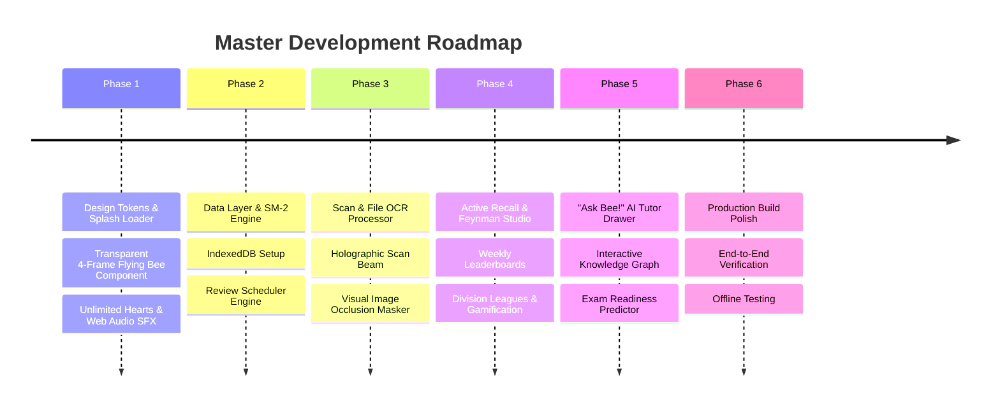

# Gizmo AI Study Engine - Master Implementation Plan

## Executive Plan Overview
The development plan is structured into 6 sequential phases. Each phase builds upon the previous, ensuring a stable foundation, seamless offline capability, cutting-edge AI integration with Google Gemini, live **Transparent Cut-Out 4-Frame Animated Mascot Bee** (`BeeAnimatedMascot.jsx`), unique killer features (Feynman Mode, Image Occlusion, Dynamic Mnemonics, Knowledge Graph, Voice Mode), branded animated splash loading screens, Web Audio SFX sound engine (Gizmo round victory fanfare), Weekly Leaderboards & Division Leagues, Unlimited Hearts practice mode, and a high-converting, gamified user experience.

---

## Phase Roadmap

---

## Detailed Phase Breakdown

### Phase 1: Web App Foundation, Transparent Flying Bee Mascot & Design System
- **1.1** Initialize React + Vite web application with standard directory layout.
- **1.2** Save processed transparent cut-out Bee mascot PNG frames (`bee_frame_1.png` to `bee_frame_4.png` and `bee_spritesheet.png`) in public assets folder.
- **1.3** Construct global CSS design system (`index.css`) containing theme tokens, sky-blue brand variables (`--primary-sky-blue: #1ea5fc`), glassmorphism card utilities, glowing aura highlights, CSS `@keyframes` (`bee-frame-loop`, `bee-flight-path`, `bee-float-bob`, `pulse-orbit`, `laser-scan`, `card-flip-3d`, `shimmer-move`, `heart-pulse`), and custom scrollbars.
- **1.4** Build **Transparent Animated Bee Mascot Component** (`BeeAnimatedMascot.jsx`): Renders continuous 4-frame transparent motion loop (winking, dashing, flying, waving) with sinusoidal flight paths across the loading screen without any square blue background box.
- **1.5** Implement **Web Audio Synthesizer Engine** (`soundService.js`): Synth sound generators for card flip pop, correct harmonic ding, wrong answer rumble, streak swoosh, level-up fanfare, and **Gizmo Round Complete Victory Fanfare**.
- **1.6** Build **App Boot Splash Loading Screen** (`SplashLoader.jsx`): Flying transparent Bee mascot with glowing orbit rings and dynamic speech bubble quotes.
- **1.7** Build responsive layout shell: Header navbar (with transparent Bee mascot avatar, title, search, **Unlimited Hearts Widget `Heart` + `∞`**, streak flame counter, XP gauge, sound toggle `Volume2`, API key button) and Sidebar navigation using standard Lucide icons (`LayoutDashboard`, `BookOpen`, `Sparkles`, `Trophy`, `Bot`, `Mic`, `EyeOff`, `Network`, `BarChart3`).

### Phase 2: Data Persistence & Spaced Repetition Engine
- **2.1** Implement IndexedDB storage engine (`storageService.js`) for Deck, Card, UserStats, DocumentScan, FeynmanLog, LeaderboardEntry, and StudySessionLog collections.
- **2.2** Build SuperMemo SM-2 Spaced Repetition core module (`spacedRepetition.js`) that calculates interval days, ease factors, repetition counts, and due dates based on ratings (*Again, Hard, Good, Easy*).
- **2.3** Seed initial sample decks ("General Science & Cell Biology", "Computer Science Essentials", "Spanish Vocabulary") complete with diagram image occlusions and pre-scheduled cards.

### Phase 3: File Scanner & Gemini AI Generation Pipeline
- **3.1** Build multimodal File Scanner dropzone (`FileScanner.jsx`) supporting PDF text extraction, image file upload, pasteable text, and **Holographic Laser Scanning Beam Animation**.
- **3.2** Integrate `@google/genai` API client (`geminiService.js`).
- **3.3** Design Gemini system prompts for:
  - Multimodal Vision OCR & Label Occlusion Detection (bounding box percentages for diagram masks).
  - Automated JSON flashcard synthesis (front/back cards, multiple choice, fill-in-the-blank snippets, and mnemonic hints).

### Phase 4: Gamified Active Recall, Leaderboards & Unlimited Hearts Mode
- **4.1** Implement Study Arena component (`StudyArena.jsx`) with 3D smooth card flip animation (`rotateY(180deg)`), Unlimited Hearts safety indicator (`Heart` + `∞`), heart pulse animation on wrong answers without lockout, and **Round Completion Overlay** featuring transparent Bee mascot's victory flight dance and fanfare sound.
- **4.2** Build **Weekly Leaderboards & Division Leagues** (`LeaderboardView.jsx`): Render Bronze, Silver, Gold, Diamond, and Master league standings table with top 3 podium crowns (`Trophy`, `Crown`), live competitor ranks, and promotion indicators.
- **4.3** Build **Feynman Method Studio** (`FeynmanStudio.jsx`): Allows students to type or speak their explanation of a card concept. Gemini evaluates the response semantically and highlights missing nuances or misconceptions.
- **4.4** Implement **Dynamic Mnemonic Generator**: Automatically triggered when cards are marked "Again" or "Hard" to give students instant personalized memory visual aids.
- **4.5** Implement Hands-Free Voice Mode utilizing browser Web Speech API for commuting/multitasking.
- **4.6** Implement Gamification Engine (`gamificationService.js`): XP accumulation (+10 per review, +50 per deck completion), streak calculation, daily goal progress ring, and level-up celebrations with confetti and fanfare.

### Phase 5: "Ask Bee!" AI Tutor Drawer, Knowledge Graph & Exam Predictor
- **5.1** Build slide-over **"Ask Bee!" AI Tutor panel** (`AITutorDrawer.jsx`) featuring transparent Bee mascot accessible during study sessions for step-by-step guidance and analogies.
- **5.2** Build **Interactive Knowledge Graph Explorer** (`KnowledgeGraph.jsx`): Render interconnected concept nodes and deck topic relationships.
- **5.3** Construct **Exam Readiness Predictor & Memory Analytics Dashboard** (`AnalyticsView.jsx`): Forgetting curve visualizer, card mastery distribution chart, exam readiness score %, and weak concepts diagnostic list.

### Phase 6: Final Polish & Comprehensive Verification
- **6.1** Perform cross-browser responsiveness check and keyboard accessibility verification.
- **6.2** Test offline review capability without internet connection.
- **6.3** Verify Gemini API key configuration and prompt fallback handling.
